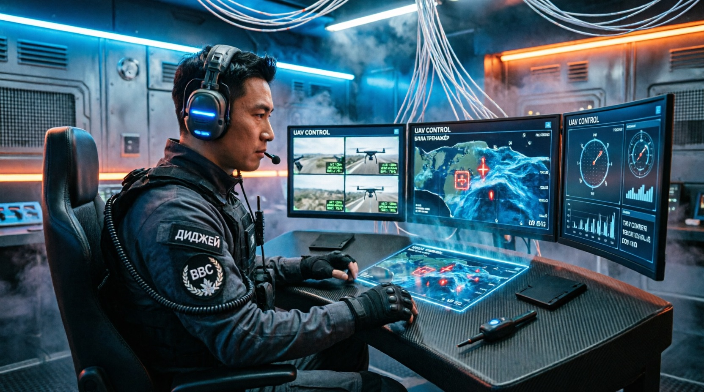

"Бесплатный открытый социальный проект с открытым исходным кодом"

🏷️ Теги
#БПЛА #FPV #тренажёр #дрон #Three.js #WebGL #офлайн #бесплатно #образование #Anti-AI-Shield #оператор-дрона #симулятор

# 🚁 БПЛА Тренажёр | Оператор ДИДЖЕЙ

> **Бесплатный социальный офлайн-проект** — интерактивный 3D-тренажёр для обучения навыкам управления беспилотными летательными аппаратами (БПЛА) и работы оператора FPV-дрона.

---

## 🎯 О проекте

Тренажёр «Оператор ДИДЖЕЙ» — это образовательная платформа, разработанная для развития навыков пилотирования FPV-дронов в безопасной виртуальной среде. Проект создан в рамках серии **Anti-AI Shield** и направлен на подготовку операторов БПЛА через игровую механику.

**Все уровни полностью бесплатны. Были и останутся.**

---

## ✨ Возможности

### 🎮 Три уровня сложности
| Уровень | Мишеней | Скорость | Сложность управления |
|---------|---------|----------|---------------------|
| 🟢 **ЛЁГКИЙ** | 5 | Медленная | Простое управление |
| 🟡 **СРЕДНИЙ** | 5 | Средняя | Стандартное управление |
| 🔴 **СЛОЖНЫЙ** | 7 | Быстрая | Высокая чувствительность |

### 🚀 Ключевые функции
- **🎯 FPV-стрельба** — ЭМИ-удар по движущимся мишеням через прицел в центре экрана
- **⚡ Система стабильности** — отслеживание устойчивости дрона в реальном времени
- **💥 Физика столкновений** — реалистичные отскоки от стен с эффектом разрушения
- **🔄 Стабилизация** — кнопка «Пробел» для экстренного выравнивания дрона
- **🎬 3D-эффекты** — взрывы, ударные волны, дымовые следы, вспышки выстрелов
- **🎵 Звуковое сопровождение** — синтезированные звуковые эффекты через Web Audio API
- **📊 Статистика** — подсчёт попаданий, стабильность, прогресс уровня
- **🏆 Модальное окно победы** — итоговая статистика с выбором: перезапуск или выход в меню

---

## 🛠️ Технологии

- **Three.js r128** — 3D-рендеринг с WebGL
- **HTML5 / CSS3** — адаптивный интерфейс с анимациями
- **Vanilla JavaScript** — без внешних фреймворков
- **Web Audio API** — процедурная генерация звуков
- **Адаптивная оптимизация** — автоматическое определение мощности устройства

---

Клавиша  Действие
W / ↑ / Ц
Вперёд (наклон вниз)
S / ↓ / Ы
Назад (наклон вверх)
A / ← / Ф
Влево (крен влево)
D / → / В
Вправо (крен вправо)
Пробел
Стабилизация дрона
ЛКМ
ЭМИ-удар (стрельба)

Сделано с ❤️ для будущих операторов БПЛА

🤝 ПОДДЕРЖАТЬ ПРОЕКТ
💙
Приложение бесплатное. Было и останется.

Если проект помог вам или вашим близким — можете поддержать разработку добровольным переводом.

📱 ПЕРЕВОД ПО НОМЕРУ ТЕЛЕФОНА:
8-920-227-56-76
📋 Копировать номер
✅ Деньги придут мгновенно. Без комиссии. Безопасно.

❤️ Спасибо за поддержку!

🌟 👉https://ancf-hue.github.io/
Каталог бесплатных офлайн-приложений Anti-AI Shield.

## 📜 Лицензия
Код доступен для изучения, модификации и некоммерческого использования.
Коммерческое распространение или интеграция в платные сервисы допускается только с письменного согласия автора.

